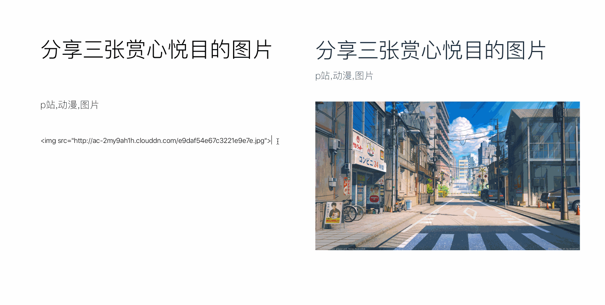
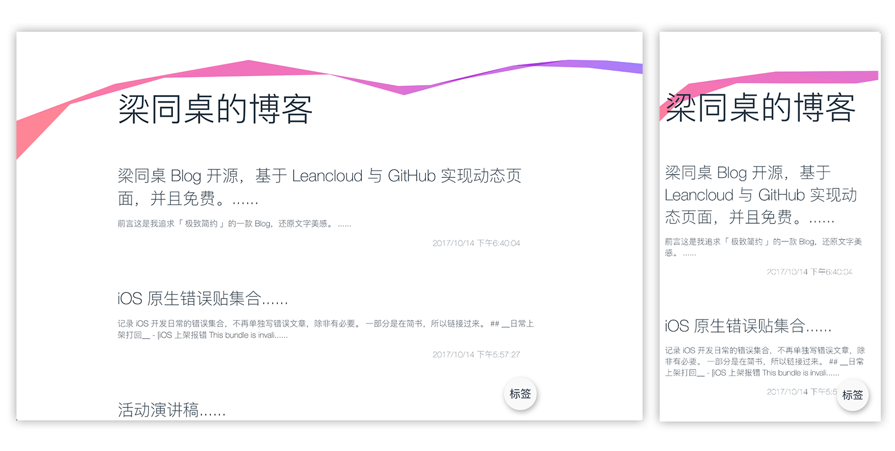

# __预览__
 

（上图展示文章编辑） 
                                                                                                                             
 
（上图展示 pc 与 mobile ） 

#  __前言__ 
「梁同桌 Blog」 是一款追求「极致简约」的产品，用简约的方法展现文字的美感。

   __「地址： http://www.liangtongzhuo.com 」__

# __功能__
- 在线实抒写 Markdowm
- 代码块高亮
- 自适应布局

# __技术依赖__
- 原生 JavaScript ，ES6 语法
- 第三方框架
  - marked 转换 Markdown
  - highlight 代码块高亮

# __技术原理__
静态页面托管到 GitHub 并生成 Pages ，使用本地 JSON 文件存储文章数据，图片存储在本地 files 目录。

## __从 LeanCloud 迁移到本地文件存储__

### __迁移原因__
- **时代变迁**：AI技术发展改变了后端基础设施需求
- **减少依赖**：摆脱第三方服务限制
- **提高性能**：本地存储加快加载速度
- **开发便捷**：本地调试无需网络
- **数据可控**：完全掌握数据所有权

### __迁移内容__
- **数据存储**：从 LeanCloud API 迁移到本地 JSON 文件（`data/articles/` 目录）
- **图片存储**：从 LeanCloud _File 迁移到本地文件（`data/files/` 目录）
- **代码简化**：移除 av.js 依赖，使用纯前端 fetch API 获取数据
- **路径修复**：确保图片路径正确解析

### __本地开发__
1. **克隆仓库**：`git clone https://github.com/liangtongzhuo/blog.git && cd blog`
2. **启动服务器**：
   - Python: `python3 -m http.server 8000`
   - Node.js: `npx http-server -p 8000`
3. **访问**：`http://localhost:8000`

### __写文章__
1. 在 `data/articles/` 创建 JSON 文件（如 `new-article.json`）
2. 基本结构：
   ```json
   {
     "title": "文章标题",
     "content": "Markdown 内容",
     "createdAt": "2026-03-20T00:00:00.000Z",
     "tag": "标签1,标签2"
   }
   ```
3. 图片放入 `data/files/` 目录，使用相对路径引用

### __部署__
1. **提交代码**：`git add . && git commit -m "Add new article" && git push`
2. **启用 GitHub Pages**：仓库 Settings -> Pages -> 选择 main 分支
3. **访问**：`https://yourusername.github.io/blog`

# __结尾__
迁移到本地文件存储后，博客系统更加独立高效，数据完全可控，同时保持了原有功能和界面。

GitHub 地址：https://github.com/liangtongzhuo/blog